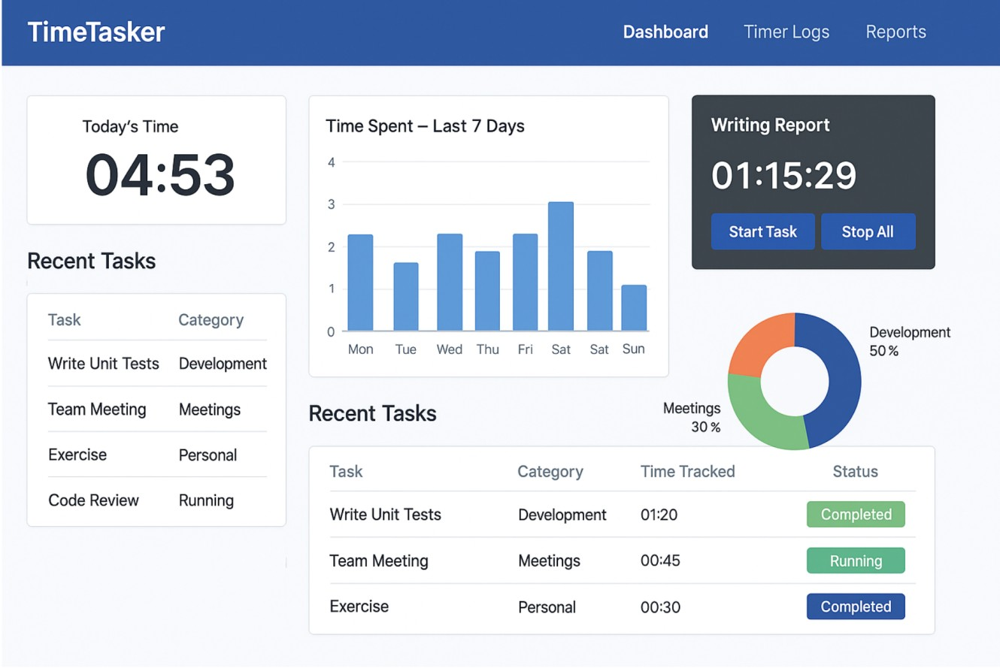
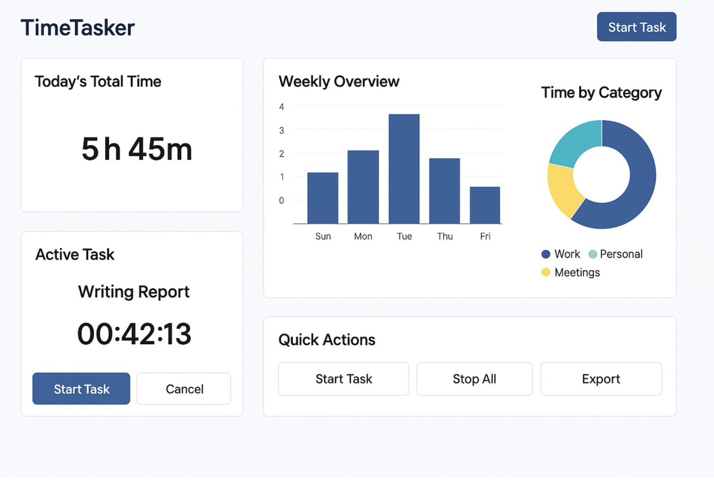
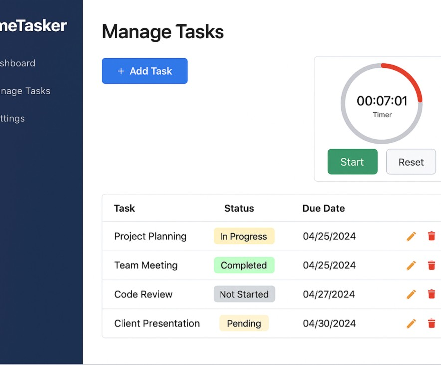

# ⏱️ TimeTasker – Smart Task Tracker with Time Insights

**TimeTasker** is a lightweight .NET Core MVC app that helps you **track your tasks** and **analyze time usage** like a pro.  
Ideal for developers, freelancers, and productivity geeks.

## 🔍 Features

- ⏳ Start/Stop timers for tasks
- 📊 Time analytics: daily/weekly reports
- 🧠 Tag and categorize tasks
- 📁 Export to CSV/JSON
- 🛠️ Built with C#, EF Core, and Bootstrap
- ☁️ Optional background job for reminders (via Hangfire)

## 🛠️ Tech Stack

- ASP.NET Core MVC
- Entity Framework Core
- Bootstrap 5
- Chart.js for analytics
- CsvHelper + Newtonsoft.Json

## 📦 Getting Started

```bash
git clone https://github.com/yourusername/TimeTasker.git
cd TimeTasker
dotnet restore
dotnet run
```

## 📸 Screenshots

### 🖥️ Dashboard View
See your daily time total, weekly breakdown, category-wise insights, and live active task.




### 🗂️ Task Management + Timer
Manage all tasks, view/edit statuses, track due dates, and run a circular live timer.


## 📬 Hire Me

Need help building or customizing productivity tools?

- 💼 [Hire me on Upwork](https://www.upwork.com/freelancers/~0101659ba9fa3c1f21)

---

**⭐ Star this repo for more .NET productivity tools!**
